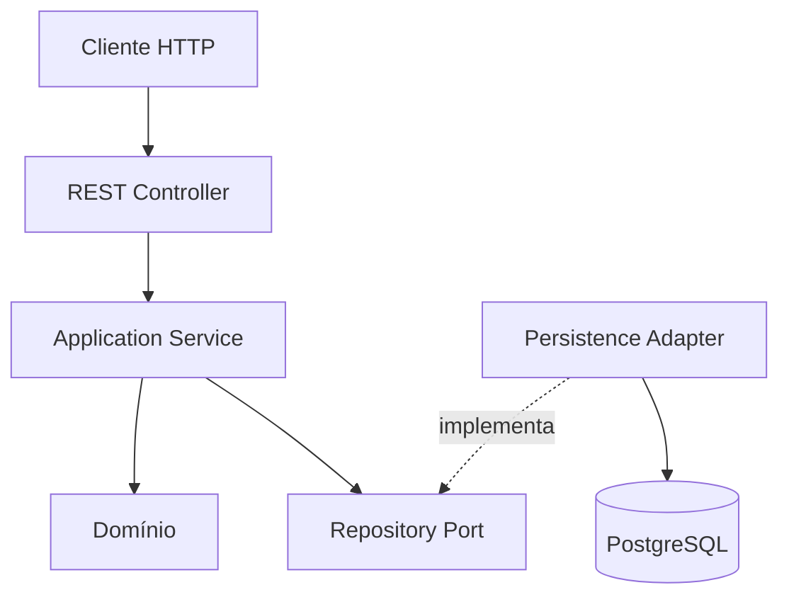

# Animal Adoption API

API REST para cadastro e gerenciamento de animais disponíveis para adoção, desenvolvida como projeto prático com Java, Spring Boot, DDD e boas práticas de programação.

> **Status:** em desenvolvimento. A estrutura do Spring Boot, o ambiente PostgreSQL local, o modelo de domínio e os casos de uso já foram implementados e validados; a persistência e os endpoints ainda serão implementados.

## Objetivo

O projeto tem como objetivo disponibilizar operações para:

- cadastrar um animal;
- consultar todos os animais;
- consultar um animal pelo identificador;
- atualizar os dados de um animal;
- excluir um animal.

O escopo foi mantido intencionalmente pequeno para priorizar organização, clareza, separação de responsabilidades, testes e aplicação prática dos conceitos estudados.

## Tecnologias

- Java 25;
- Spring Boot 4.1.1;
- Maven Wrapper;
- Spring Web MVC;
- Spring Data JPA;
- Bean Validation;
- PostgreSQL 18;
- Docker e Docker Compose;
- Lombok;
- JUnit 5, Mockito e MockMvc.

## Modelo de domínio

O agregado `Animal` é responsável por manter seus dados e proteger as regras do domínio.

| Campo | Tipo | Regra |
| --- | --- | --- |
| `id` | `AnimalId` | Gerado pela aplicação a partir de um `UUID` |
| `name` | `String` | Obrigatório e não vazio |
| `species` | `String` | Obrigatório e não vazio |
| `breed` | `String` | Opcional |
| `age` | `Integer` | Obrigatório e não negativo |
| `status` | `AdoptionStatus` | Inicia como `AVAILABLE` |

O identificador é representado no domínio por um Value Object implementado como `record`:

```java
public record AnimalId(UUID value) {

    public AnimalId {
        if (value == null) {
            throw new IllegalArgumentException(
                    "O identificador do animal não pode ser nulo"
            );
        }
    }

    public static AnimalId generate() {
        return new AnimalId(UUID.randomUUID());
    }
}
```

O banco armazenará o valor como `UUID`. A conversão entre `UUID` e `AnimalId` ficará na camada de infraestrutura, evitando dependências do JPA no Value Object de domínio.

O `AdoptionStatus` possui os estados `AVAILABLE` e `ADOPTED`.

### Regras implementadas

- o identificador é gerado pela aplicação e não é recebido no cadastro;
- nome e espécie não podem ser nulos ou vazios;
- a idade não pode ser nula ou negativa;
- raça é opcional e valores vazios são normalizados para `null`;
- um animal novo inicia com o status `AVAILABLE`;
- a alteração dos dados é atômica e passa por um comportamento do agregado;
- o domínio não possui setters públicos indiscriminados.

O método `Animal.create(...)` cria novos animais com identificador próprio e status `AVAILABLE`. O método `Animal.restore(...)` permite reconstruir um agregado persistido, enquanto `updateDetails(...)` e `markAsAdopted()` concentram as mudanças de estado.

## Arquitetura

O projeto utiliza um DDD pragmático, com separação entre domínio, aplicação, infraestrutura e apresentação.



### Responsabilidades

- **Domain:** entidade, Value Objects, enumerações, regras e contrato do repositório. Não depende do Spring ou do JPA.
- **Application:** coordena os casos de uso e as transações da aplicação.
- **Infrastructure:** implementa a persistência com Spring Data JPA e PostgreSQL.
- **Presentation:** recebe requisições HTTP, valida DTOs, chama a aplicação e monta as respostas.

### Estrutura planejada

```text
src/main/java/br/com/pedropavanello/animal_adoption_api/
├── AnimalAdoptionApiApplication.java
└── animal/
    ├── domain/
    │   ├── model/
    │   │   ├── Animal.java
    │   │   ├── AnimalId.java
    │   │   └── AdoptionStatus.java
    │   └── repository/
    │       └── AnimalRepository.java
    ├── application/
    │   ├── command/
    │   │   ├── CreateAnimalCommand.java
    │   │   └── UpdateAnimalCommand.java
    │   ├── exception/
    │   │   └── AnimalNotFoundException.java
    │   └── service/
    │       └── AnimalService.java
    ├── infrastructure/
    │   └── persistence/
    │       ├── AnimalJpaEntity.java
    │       ├── SpringDataAnimalRepository.java
    │       ├── AnimalRepositoryAdapter.java
    │       └── AnimalPersistenceMapper.java
    └── presentation/
        ├── controller/
        │   └── AnimalController.java
        ├── dto/
        │   ├── CreateAnimalRequest.java
        │   ├── UpdateAnimalRequest.java
        │   └── AnimalResponse.java
        └── exception/
            └── ApiExceptionHandler.java
```

As camadas de domínio e aplicação dessa estrutura já foram implementadas. As demais camadas serão adicionadas gradualmente e poderão receber pequenos ajustes justificados durante a implementação.

## Casos de uso implementados

O `AnimalService` coordena os casos de uso e depende somente do contrato de domínio `AnimalRepository`.

| Método | Responsabilidade |
| --- | --- |
| `create(...)` | Cria um animal e solicita sua persistência |
| `findById(...)` | Consulta um animal ou lança `AnimalNotFoundException` |
| `findAll()` | Lista todos os animais |
| `update(...)` | Localiza, altera e solicita a persistência do animal |
| `delete(...)` | Localiza e solicita a exclusão do animal |

As entradas de cadastro e atualização são representadas por `CreateAnimalCommand` e `UpdateAnimalCommand`. Esses comandos não dependem dos futuros DTOs HTTP.

O serviço ainda não está registrado como bean do Spring. O registro e os limites transacionais serão adicionados junto ao adapter de persistência, evitando uma dependência obrigatória inexistente durante esta etapa.

## Contrato REST planejado

Base path:

```text
/api/v1/animals
```

| Método | Endpoint | Descrição | Resposta esperada |
| --- | --- | --- | --- |
| `POST` | `/api/v1/animals` | Cadastra um animal | `201 Created` |
| `GET` | `/api/v1/animals` | Lista os animais | `200 OK` |
| `GET` | `/api/v1/animals/{id}` | Consulta um animal pelo ID | `200 OK` ou `404 Not Found` |
| `PUT` | `/api/v1/animals/{id}` | Atualiza completamente um animal | `200 OK` ou `404 Not Found` |
| `DELETE` | `/api/v1/animals/{id}` | Exclui um animal | `204 No Content` ou `404 Not Found` |

Os endpoints descritos acima ainda serão implementados.

### Exemplo planejado de cadastro

```json
{
  "name": "Luna",
  "species": "Cachorro",
  "breed": "Vira-lata",
  "age": 3
}
```

### Exemplo planejado de resposta

```json
{
  "id": "22db84db-3012-4c3e-85bb-7a0401e8a752",
  "name": "Luna",
  "species": "Cachorro",
  "breed": "Vira-lata",
  "age": 3,
  "status": "AVAILABLE"
}
```

## Persistência

O PostgreSQL é executado em um container baseado na imagem `postgres:18`, com volume nomeado para persistência dos dados locais. O ambiente está definido no arquivo `compose.yaml`.

O projeto não utilizará uma ferramenta de migrations. Durante o desenvolvimento acadêmico, a criação e a atualização do esquema serão realizadas pelo Hibernate com:

```properties
spring.jpa.hibernate.ddl-auto=update
```

Essa configuração simplifica a execução local, mas não é recomendada para ambientes de produção, nos quais mudanças de esquema devem ser versionadas e controladas.

As configurações locais são disponibilizadas no `.env.example`. O arquivo `.env`, que contém a senha utilizada no ambiente de cada desenvolvedor, permanece ignorado pelo Git.

A aplicação importa o `.env` como arquivo de propriedades e utiliza suas variáveis para criar a conexão JDBC. Nenhuma credencial é mantida no `application.yaml`.

## Execução local

### Pré-requisitos

- JDK 25;
- Docker Engine;
- Docker Compose;
- Git.

Não é necessário instalar o Maven globalmente, pois o projeto inclui o Maven Wrapper.

### Preparar as variáveis locais

```bash
cp .env.example .env
```

Altere o valor de `POSTGRES_PASSWORD` somente no arquivo `.env`. Não versione esse arquivo.

### Iniciar o PostgreSQL

```bash
docker compose up -d
docker compose ps
```

O serviço estará pronto quando seu estado aparecer como `healthy`. A disponibilidade também pode ser verificada com:

```bash
docker compose exec postgres sh -c 'pg_isready -U "$POSTGRES_USER" -d "$POSTGRES_DB"'
```

### Executar os testes

Com o PostgreSQL ativo:

```bash
./mvnw test
```

### Executar a aplicação

```bash
./mvnw spring-boot:run
```

### Encerrar o ambiente

```bash
docker compose down
```

O comando acima remove o container e a rede do projeto, mas preserva o volume nomeado e os dados do PostgreSQL.

## Estratégia de testes

Já foram implementados testes unitários para o `AnimalId`, para as regras do agregado `Animal` e para os casos de uso do `AnimalService`. Os testes da aplicação utilizam Mockito para isolar o contrato `AnimalRepository`.

Permanecem planejados:

- testes da camada web com MockMvc;
- testes dos fluxos de sucesso, validação e recurso inexistente.

Os testes não serão alterados apenas para ocultar falhas. Cada comportamento testado deverá representar o contrato real da aplicação.

## Convenções de desenvolvimento

- injeção de dependências por construtor;
- DTOs separados do modelo de domínio;
- validação das entradas na borda da aplicação;
- tratamento centralizado e explícito de erros;
- ausência de stack traces nas respostas HTTP;
- ausência de `@Data` e setters públicos nas entidades;
- uso controlado do Lombok;
- commits pequenos com uma responsabilidade clara;
- alterações integradas por Pull Request.

### Exemplos de commits

```text
chore(projeto): inicia projeto Spring Boot
docs(projeto): documenta escopo e arquitetura do projeto
chore(banco): configura ambiente local com PostgreSQL
chore(configuracao): configura conexão da aplicação com PostgreSQL
docs(readme): atualiza instruções do ambiente local
feat(animal): modela agregado de animal
feat(aplicacao): implementa casos de uso de animais
feat(persistencia): implementa adaptador do repositório de animais
feat(api): disponibiliza endpoints CRUD de animais
test(api): cobre fluxos CRUD de animais
```

## Roadmap

- [x] Gerar a estrutura inicial com Spring Initializr;
- [x] validar a compilação com Java 25;
- [x] documentar escopo, arquitetura e contrato planejado;
- [x] configurar PostgreSQL 18 com Docker Compose;
- [x] configurar a conexão da aplicação com o banco;
- [x] validar o contexto Spring com o PostgreSQL ativo;
- [x] modelar o domínio de animais;
- [x] implementar os casos de uso;
- [ ] implementar o adapter de persistência;
- [ ] implementar os endpoints REST;
- [ ] implementar validações e tratamento de erros;
- [ ] concluir os testes automatizados das demais camadas;
- [ ] validar todos os fluxos da apresentação prática;
- [ ] atualizar a documentação com os comandos e resultados finais.

## Autores

- [Pedro Pavanello](https://github.com/devpedropavanello)
- [Renan](https://github.com/RenanHyts01)