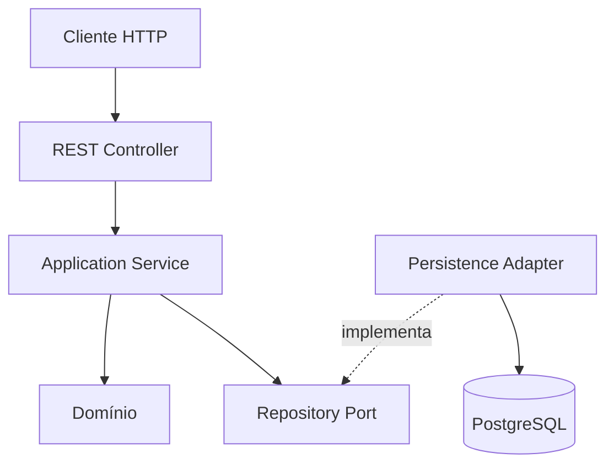

# Animal Adoption API

API REST para cadastro e gerenciamento de animais disponíveis para adoção, desenvolvida como projeto prático com Java, Spring Boot, DDD e boas práticas de programação.

> **Status:** concluída para o escopo acadêmico atual. O domínio, os casos de uso, a persistência, os endpoints REST, as validações, o tratamento de erros e os testes automatizados foram implementados e validados.

## Objetivo

O projeto disponibiliza operações para:

- cadastrar um animal;
- consultar todos os animais;
- consultar um animal pelo identificador;
- atualizar os dados de um animal;
- atualizar o status de adoção;
- reverter o status de adoção;
- excluir um animal.

O escopo foi mantido intencionalmente pequeno para priorizar organização, clareza, separação de responsabilidades, testes e aplicação prática dos conceitos estudados.

## Tecnologias

- Java 25;
- Spring Boot 4.1.1;
- Maven Wrapper;
- Spring Web MVC;
- Spring Data JPA;
- Bean Validation;
- PostgreSQL 18;
- Docker e Docker Compose;
- Lombok;
- JUnit 5;
- Mockito;
- MockMvc.

## Modelo de domínio

O agregado `Animal` é responsável por manter seus dados e proteger as regras do domínio.

| Campo | Tipo | Regra |
| --- | --- | --- |
| `id` | `AnimalId` | Gerado pela aplicação a partir de um `UUID` |
| `name` | `String` | Obrigatório e não vazio |
| `species` | `String` | Obrigatório e não vazio |
| `breed` | `String` | Opcional |
| `age` | `Integer` | Obrigatório e não negativo |
| `status` | `AdoptionStatus` | Inicia como `AVAILABLE` |

### Identificador

O identificador é representado no domínio por um Value Object implementado como `record`:

```java
public record AnimalId(UUID value) {

    public AnimalId {
        if (value == null) {
            throw new IllegalArgumentException(
                    "O identificador do animal não pode ser nulo"
            );
        }
    }

    public static AnimalId generate() {
        return new AnimalId(UUID.randomUUID());
    }
}
```

O PostgreSQL armazena o identificador como `UUID`. A conversão entre `UUID` e `AnimalId` é realizada na camada de infraestrutura, evitando dependências do JPA no Value Object de domínio.

### Status de adoção

O `AdoptionStatus` possui dois estados:

```java
public enum AdoptionStatus {
    AVAILABLE,
    ADOPTED
}
```

As alterações são realizadas por comportamentos explícitos do agregado:

- `markAsAdopted()` altera o status para `ADOPTED`;
- `markAsAvailable()` altera o status para `AVAILABLE`.

As operações são idempotentes: solicitar o estado que o animal já possui mantém o mesmo resultado sem gerar inconsistência.

### Regras implementadas

- o identificador é gerado pela aplicação e não é recebido no cadastro;
- nome e espécie não podem ser nulos ou vazios;
- a idade não pode ser nula ou negativa;
- raça é opcional;
- valores vazios de raça são normalizados para `null`;
- um animal novo inicia com o status `AVAILABLE`;
- o status pode ser alterado entre `AVAILABLE` e `ADOPTED`;
- a alteração dos dados é atômica;
- mudanças de estado passam por comportamentos do agregado;
- o domínio não possui setters públicos indiscriminados.

O método `Animal.create(...)` cria novos animais com identificador próprio e status `AVAILABLE`.

O método `Animal.restore(...)` reconstrói um agregado persistido. Os métodos `updateDetails(...)`, `markAsAdopted()` e `markAsAvailable()` concentram as alterações de estado.

## Arquitetura

O projeto utiliza um DDD pragmático, com separação entre domínio, aplicação, infraestrutura e apresentação.



### Responsabilidades

- **Domain:** agregado, Value Object, enumeração, regras de negócio e contrato do repositório.
- **Application:** coordena os casos de uso e define os limites transacionais.
- **Infrastructure:** implementa a persistência com Spring Data JPA e PostgreSQL.
- **Presentation:** recebe requisições HTTP, valida DTOs, converte os dados e monta as respostas.

O domínio não depende do Spring, do JPA ou da camada HTTP.

### Estrutura do projeto

```text
src/main/java/br/com/pedropavanello/animal_adoption_api/
├── AnimalAdoptionApiApplication.java
└── animal/
    ├── domain/
    │   ├── model/
    │   │   ├── Animal.java
    │   │   ├── AnimalId.java
    │   │   └── AdoptionStatus.java
    │   └── repository/
    │       └── AnimalRepository.java
    ├── application/
    │   ├── command/
    │   │   ├── CreateAnimalCommand.java
    │   │   ├── UpdateAnimalCommand.java
    │   │   └── UpdateAdoptionStatusCommand.java
    │   ├── exception/
    │   │   └── AnimalNotFoundException.java
    │   └── service/
    │       └── AnimalService.java
    ├── infrastructure/
    │   └── persistence/
    │       ├── AnimalJpaEntity.java
    │       ├── AnimalPersistenceMapper.java
    │       ├── AnimalRepositoryAdapter.java
    │       └── SpringDataAnimalRepository.java
    └── presentation/
        ├── controller/
        │   └── AnimalController.java
        ├── dto/
        │   ├── AnimalResponse.java
        │   ├── CreateAnimalRequest.java
        │   ├── UpdateAnimalRequest.java
        │   └── UpdateAdoptionStatusRequest.java
        ├── exception/
        │   ├── ApiErrorResponse.java
        │   └── ApiExceptionHandler.java
        └── mapper/
            └── AnimalPresentationMapper.java
```

## Casos de uso

O `AnimalService` coordena os casos de uso e depende do contrato de domínio `AnimalRepository`.

| Método | Responsabilidade |
| --- | --- |
| `create(...)` | Cria e persiste um animal |
| `findById(...)` | Consulta um animal ou lança `AnimalNotFoundException` |
| `findAll()` | Lista todos os animais |
| `update(...)` | Atualiza os dados completos de um animal |
| `updateAdoptionStatus(...)` | Atualiza ou reverte o status de adoção |
| `delete(...)` | Exclui um animal existente |

As entradas da camada de aplicação são representadas por:

- `CreateAnimalCommand`;
- `UpdateAnimalCommand`;
- `UpdateAdoptionStatusCommand`.

Esses comandos não dependem dos DTOs HTTP.

O serviço utiliza `@Transactional(readOnly = true)` por padrão. Os casos de uso que alteram dados sobrescrevem essa configuração com `@Transactional`.

## Contrato REST

Base path:

```text
/api/v1/animals
```

| Método | Endpoint | Descrição | Respostas principais |
| --- | --- | --- | --- |
| `POST` | `/api/v1/animals` | Cadastra um animal | `201 Created` ou `400 Bad Request` |
| `GET` | `/api/v1/animals` | Lista os animais | `200 OK` |
| `GET` | `/api/v1/animals/{id}` | Consulta um animal pelo ID | `200 OK`, `400 Bad Request` ou `404 Not Found` |
| `PUT` | `/api/v1/animals/{id}` | Atualiza completamente um animal | `200 OK`, `400 Bad Request` ou `404 Not Found` |
| `PATCH` | `/api/v1/animals/{id}/adoption-status` | Atualiza o status de adoção | `200 OK`, `400 Bad Request` ou `404 Not Found` |
| `DELETE` | `/api/v1/animals/{id}` | Exclui um animal | `204 No Content`, `400 Bad Request` ou `404 Not Found` |

### Cadastrar um animal

Requisição:

```json
{
  "name": "Luna",
  "species": "Cachorro",
  "breed": "Vira-lata",
  "age": 3
}
```

Resposta:

```json
{
  "id": "22db84db-3012-4c3e-85bb-7a0401e8a752",
  "name": "Luna",
  "species": "Cachorro",
  "breed": "Vira-lata",
  "age": 3,
  "status": "AVAILABLE"
}
```

O cadastro retorna `201 Created` e inclui no cabeçalho `Location` a URL do novo recurso.

### Atualizar os dados

O `PUT` representa uma atualização completa. Portanto, todos os campos obrigatórios devem ser enviados:

```json
{
  "name": "Luna Atualizada",
  "species": "Cachorro",
  "breed": "Labrador",
  "age": 4
}
```

O identificador e o status não são recebidos nessa operação.

### Marcar como adotado

```json
{
  "status": "ADOPTED"
}
```

### Reverter para disponível

```json
{
  "status": "AVAILABLE"
}
```

Os valores do status devem ser enviados em letras maiúsculas, conforme os valores definidos no enum.

## Validações

As entradas HTTP são validadas com Bean Validation.

### Cadastro e atualização

- `name`: obrigatório e não vazio;
- `species`: obrigatório e não vazio;
- `breed`: opcional;
- `age`: obrigatório e maior ou igual a zero.

### Atualização de status

- `status`: obrigatório;
- valores permitidos: `AVAILABLE` e `ADOPTED`.

As validações HTTP protegem a borda da aplicação. O domínio também mantém suas próprias invariantes para não depender exclusivamente da camada web.

## Tratamento de erros

O tratamento é centralizado em `ApiExceptionHandler`, implementado com `@RestControllerAdvice`.

São tratados explicitamente:

- animal inexistente;
- campos inválidos;
- UUID inválido;
- JSON ausente ou malformado;
- valores rejeitados pelas regras do domínio.

### Exemplo de erro de validação

```json
{
  "timestamp": "2026-09-15T20:00:00Z",
  "status": 400,
  "error": "Bad Request",
  "message": "Um ou mais campos estão inválidos",
  "path": "/api/v1/animals",
  "fieldErrors": {
    "name": "O nome do animal é obrigatório",
    "species": "A espécie do animal é obrigatória",
    "age": "A idade do animal não pode ser negativa"
  }
}
```

### Exemplo de animal inexistente

```json
{
  "timestamp": "2026-09-15T20:00:00Z",
  "status": 404,
  "error": "Not Found",
  "message": "Animal não encontrado com o identificador: 22db84db-3012-4c3e-85bb-7a0401e8a752",
  "path": "/api/v1/animals/22db84db-3012-4c3e-85bb-7a0401e8a752",
  "fieldErrors": {}
}
```

As respostas tratadas não expõem stack traces ou detalhes internos da aplicação.

## Persistência

O PostgreSQL é executado em um container baseado na imagem `postgres:18`, com volume nomeado para persistência dos dados locais. O ambiente está definido no arquivo `compose.yaml`.

### Componentes

- `AnimalJpaEntity`: representa a tabela `animals`;
- `SpringDataAnimalRepository`: fornece as operações do Spring Data JPA;
- `AnimalPersistenceMapper`: converte entre o agregado e a entidade JPA;
- `AnimalRepositoryAdapter`: implementa o contrato `AnimalRepository` do domínio.

O identificador é gerado pela aplicação e persistido como `UUID`.

O status é armazenado pelo nome do enum com `EnumType.STRING`, evitando dependência da ordem dos valores.

### Criação do esquema

O projeto não utiliza uma ferramenta de migrations.

Durante o desenvolvimento acadêmico, a criação e a atualização do esquema são realizadas pelo Hibernate com:

```properties
spring.jpa.hibernate.ddl-auto=update
```

Essa configuração simplifica a execução local. Em um ambiente de produção, mudanças de esquema deveriam ser versionadas e controladas por uma ferramenta de migrations.

### Variáveis locais

As configurações locais são disponibilizadas no `.env.example`.

O arquivo `.env`, que contém os valores utilizados por cada desenvolvedor, permanece ignorado pelo Git.

A aplicação importa o `.env` como arquivo de propriedades e utiliza suas variáveis para criar a conexão JDBC. Nenhuma credencial é mantida no `application.yaml`.

## Execução local

### Pré-requisitos

- JDK 25;
- Docker Engine;
- Docker Compose;
- Git.

Não é necessário instalar o Maven globalmente, pois o projeto inclui o Maven Wrapper.

### Preparar as variáveis locais

```bash
cp .env.example .env
```

Altere o valor de `POSTGRES_PASSWORD` somente no arquivo `.env`.

Não versione esse arquivo.

### Iniciar o PostgreSQL

```bash
docker compose up -d
docker compose ps
```

O serviço estará pronto quando seu estado aparecer como `healthy`.

A disponibilidade também pode ser verificada com:

```bash
docker compose exec postgres sh -c \
  'pg_isready -U "$POSTGRES_USER" -d "$POSTGRES_DB"'
```

### Executar os testes

Com o PostgreSQL ativo:

```bash
./mvnw test
```

### Executar a aplicação

```bash
./mvnw spring-boot:run
```

A API ficará disponível em:

```text
http://localhost:8080
```

### Encerrar a aplicação

No terminal em que a aplicação está executando:

```text
Ctrl+C
```

### Encerrar o PostgreSQL

```bash
docker compose down
```

O comando remove o container e a rede do projeto, mas preserva o volume nomeado e os dados do PostgreSQL.

Para remover também o volume e os dados seria necessário utilizar `docker compose down -v`. Esse comando é destrutivo e não é necessário para a execução normal do projeto.

## Exemplos com cURL

### Cadastrar

```bash
curl -i \
  -H 'Content-Type: application/json' \
  -d '{
    "name": "Luna",
    "species": "Cachorro",
    "breed": "Vira-lata",
    "age": 3
  }' \
  http://localhost:8080/api/v1/animals
```

Copie o UUID retornado e defina uma variável:

```bash
ANIMAL_ID="UUID_RETORNADO_PELA_API"
```

### Listar

```bash
curl -i \
  http://localhost:8080/api/v1/animals
```

### Consultar pelo ID

```bash
curl -i \
  "http://localhost:8080/api/v1/animals/${ANIMAL_ID}"
```

### Atualizar os dados

```bash
curl -i \
  -X PUT \
  -H 'Content-Type: application/json' \
  -d '{
    "name": "Luna Atualizada",
    "species": "Cachorro",
    "breed": "Labrador",
    "age": 4
  }' \
  "http://localhost:8080/api/v1/animals/${ANIMAL_ID}"
```

### Marcar como adotado

```bash
curl -i \
  -X PATCH \
  -H 'Content-Type: application/json' \
  -d '{
    "status": "ADOPTED"
  }' \
  "http://localhost:8080/api/v1/animals/${ANIMAL_ID}/adoption-status"
```

### Reverter para disponível

```bash
curl -i \
  -X PATCH \
  -H 'Content-Type: application/json' \
  -d '{
    "status": "AVAILABLE"
  }' \
  "http://localhost:8080/api/v1/animals/${ANIMAL_ID}/adoption-status"
```

### Excluir

```bash
curl -i \
  -X DELETE \
  "http://localhost:8080/api/v1/animals/${ANIMAL_ID}"
```

## Estratégia de testes

O projeto possui testes automatizados para as diferentes camadas.

### Domínio

- validação do `AnimalId`;
- criação e restauração do agregado;
- validação dos dados;
- atualização atômica;
- alteração para `ADOPTED`;
- reversão para `AVAILABLE`.

### Aplicação

- cadastro;
- consulta por ID;
- listagem;
- atualização;
- exclusão;
- atualização do status;
- reversão do status;
- recurso inexistente;
- comandos inválidos.

Os testes do `AnimalService` utilizam Mockito para isolar o contrato `AnimalRepository`.

### Persistência

- conversão entre agregado e entidade JPA;
- delegação do adapter ao Spring Data;
- cadastro, consulta, atualização, listagem e exclusão no PostgreSQL real.

Os testes de integração utilizam transações para preservar o isolamento dos cenários.

### Apresentação

- conversão entre DTOs, comandos e respostas;
- cadastro com `201 Created`;
- cabeçalho `Location`;
- listagem e consulta;
- atualização completa;
- atualização e reversão do status;
- exclusão com `204 No Content`;
- validação dos campos;
- UUID inválido;
- JSON malformado;
- recurso inexistente.

Os testes da camada web utilizam `MockMvc` e substituem o serviço por um mock.

A suíte completa foi executada com sucesso utilizando Java 25, Spring Boot 4.1.1 e PostgreSQL 18.

## Validação manual

Os seguintes fluxos foram validados com a aplicação e o PostgreSQL em execução:

| Operação | Resultado |
| --- | --- |
| Cadastro | `201 Created` |
| Listagem | `200 OK` |
| Consulta por ID | `200 OK` |
| Atualização completa | `200 OK` |
| Alteração para `ADOPTED` | `200 OK` |
| Reversão para `AVAILABLE` | `200 OK` |
| Exclusão | `204 No Content` |
| Consulta após exclusão | `404 Not Found` |

## Convenções de desenvolvimento

- injeção de dependências por construtor;
- DTOs separados do modelo de domínio;
- comandos separados dos DTOs HTTP;
- validação das entradas na borda da aplicação;
- invariantes protegidas pelo domínio;
- tratamento centralizado e explícito de erros;
- ausência de stack traces nas respostas tratadas;
- ausência de `@Data` e setters públicos nas entidades;
- uso controlado do Lombok;
- transações definidas na camada de aplicação;
- commits pequenos com uma responsabilidade clara;
- alterações integradas por Pull Request.

### Exemplos de commits

```text
chore(projeto): inicia projeto Spring Boot
docs(projeto): documenta escopo e arquitetura do projeto
chore(banco): configura ambiente local com PostgreSQL
chore(configuracao): configura conexão da aplicação com PostgreSQL
feat(animal): modela agregado de animal
feat(aplicacao): implementa casos de uso de animais
feat(persistencia): implementa adaptador do repositório de animais
feat(api): disponibiliza endpoints CRUD de animais
feat(animal): permite reverter status de adoção
feat(aplicacao): implementa atualização do status de adoção
feat(api): disponibiliza atualização do status de adoção
test(api): cobre endpoints e respostas de erro
```

## Roadmap

- [x] gerar a estrutura inicial com Spring Initializr;
- [x] validar a compilação com Java 25;
- [x] documentar o escopo e a arquitetura;
- [x] configurar PostgreSQL 18 com Docker Compose;
- [x] configurar a conexão da aplicação com o banco;
- [x] modelar o domínio de animais;
- [x] implementar os casos de uso;
- [x] implementar o adapter de persistência;
- [x] implementar os endpoints REST;
- [x] implementar a atualização do status de adoção;
- [x] implementar validações e tratamento de erros;
- [x] criar testes automatizados;
- [x] validar os fluxos CRUD;
- [x] validar adoção e reversão;
- [x] atualizar a documentação final.

## Autores

- [Pedro Henrique Guimarães Pavanello - 202310824](https://github.com/devpedropavanello)
- [Renan Augusto S. Silva - 202311388](https://github.com/RenanHyts01)