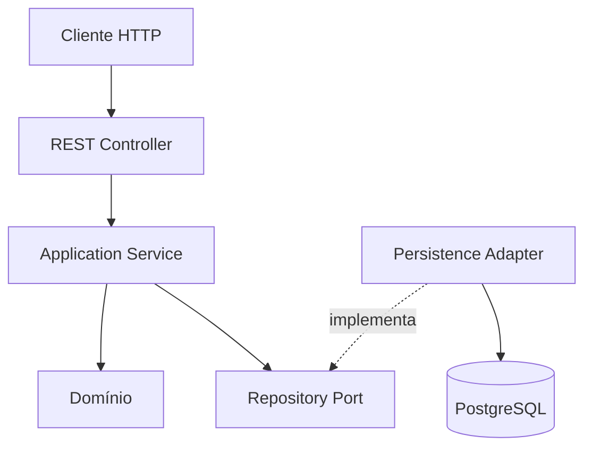

# Animal Adoption API

API REST para cadastro e gerenciamento de animais disponíveis para adoção, desenvolvida como projeto prático com Java, Spring Boot, DDD e boas práticas de programação.

> **Status:** em desenvolvimento. A estrutura inicial do Spring Boot já foi gerada; o domínio, o banco de dados e os endpoints ainda serão implementados.

## Objetivo

O projeto tem como objetivo disponibilizar operações para:

- cadastrar um animal;
- consultar todos os animais;
- consultar um animal pelo identificador;
- atualizar os dados de um animal;
- excluir um animal.

O escopo foi mantido intencionalmente pequeno para priorizar organização, clareza, separação de responsabilidades, testes e aplicação prática dos conceitos estudados.

## Tecnologias

- Java 25;
- Spring Boot 4.1.1;
- Maven Wrapper;
- Spring Web MVC;
- Spring Data JPA;
- Bean Validation;
- PostgreSQL 18;
- Docker e Docker Compose;
- Lombok;
- JUnit 5, Mockito e MockMvc.

## Modelo de domínio planejado

O agregado `Animal` será responsável por manter seus dados e proteger as regras do domínio.

| Campo | Tipo | Regra planejada |
| --- | --- | --- |
| `id` | `AnimalId` | Gerado pela aplicação a partir de um `UUID` |
| `name` | `String` | Obrigatório e não vazio |
| `species` | `String` | Obrigatório e não vazio |
| `breed` | `String` | Opcional |
| `age` | `Integer` | Obrigatório e não negativo |
| `status` | `AdoptionStatus` | Inicia como `AVAILABLE` |

O identificador será representado no domínio por um Value Object:

```java
public record AnimalId(UUID value) {
}
```

O banco armazenará o valor como `UUID`. A conversão entre `UUID` e `AnimalId` ficará na camada de infraestrutura, evitando dependências do JPA no Value Object de domínio.

### Regras planejadas

- o identificador será gerado pela aplicação e não será recebido no cadastro;
- nome e espécie não poderão ser vazios;
- a idade não poderá ser negativa;
- um animal novo iniciará com o status `AVAILABLE`;
- alterações deverão passar pelos comportamentos do domínio, sem setters públicos indiscriminados.

## Arquitetura

Será utilizado um DDD pragmático, com separação entre domínio, aplicação, infraestrutura e apresentação.



### Responsabilidades

- **Domain:** entidade, Value Objects, enumerações, regras e contrato do repositório. Não depende do Spring ou do JPA.
- **Application:** coordena os casos de uso e as transações da aplicação.
- **Infrastructure:** implementa a persistência com Spring Data JPA e PostgreSQL.
- **Presentation:** recebe requisições HTTP, valida DTOs, chama a aplicação e monta as respostas.

### Estrutura planejada

```text
src/main/java/br/com/pedropavanello/animaladoption/
├── AnimalAdoptionApiApplication.java
└── animal/
    ├── domain/
    │   ├── model/
    │   │   ├── Animal.java
    │   │   ├── AnimalId.java
    │   │   └── AdoptionStatus.java
    │   └── repository/
    │       └── AnimalRepository.java
    ├── application/
    │   └── service/
    │       └── AnimalService.java
    ├── infrastructure/
    │   └── persistence/
    │       ├── AnimalJpaEntity.java
    │       ├── SpringDataAnimalRepository.java
    │       ├── AnimalRepositoryAdapter.java
    │       └── AnimalPersistenceMapper.java
    └── presentation/
        ├── controller/
        │   └── AnimalController.java
        ├── dto/
        │   ├── CreateAnimalRequest.java
        │   ├── UpdateAnimalRequest.java
        │   └── AnimalResponse.java
        └── exception/
            └── ApiExceptionHandler.java
```

Essa estrutura representa o planejamento inicial e poderá receber pequenos ajustes justificados durante a implementação.

## Contrato REST planejado

Base path:

```text
/api/v1/animals
```

| Método | Endpoint | Descrição | Resposta esperada |
| --- | --- | --- | --- |
| `POST` | `/api/v1/animals` | Cadastra um animal | `201 Created` |
| `GET` | `/api/v1/animals` | Lista os animais | `200 OK` |
| `GET` | `/api/v1/animals/{id}` | Consulta um animal pelo ID | `200 OK` ou `404 Not Found` |
| `PUT` | `/api/v1/animals/{id}` | Atualiza completamente um animal | `200 OK` ou `404 Not Found` |
| `DELETE` | `/api/v1/animals/{id}` | Exclui um animal | `204 No Content` ou `404 Not Found` |

Os endpoints descritos acima ainda serão implementados.

### Exemplo planejado de cadastro

```json
{
  "name": "Luna",
  "species": "Cachorro",
  "breed": "Vira-lata",
  "age": 3
}
```

### Exemplo planejado de resposta

```json
{
  "id": "22db84db-3012-4c3e-85bb-7a0401e8a752",
  "name": "Luna",
  "species": "Cachorro",
  "breed": "Vira-lata",
  "age": 3,
  "status": "AVAILABLE"
}
```

## Persistência

O PostgreSQL será executado em um container baseado na imagem `postgres:18`, com volume nomeado para persistência dos dados locais.

O projeto não utilizará uma ferramenta de migrations. Durante o desenvolvimento acadêmico, a criação e a atualização do esquema serão realizadas pelo Hibernate com:

```properties
spring.jpa.hibernate.ddl-auto=update
```

Essa configuração simplifica a execução local, mas não é recomendada para ambientes de produção, nos quais mudanças de esquema devem ser versionadas e controladas.

Credenciais e configurações sensíveis não serão versionadas. O projeto disponibilizará um `.env.example`, enquanto o arquivo `.env` permanecerá ignorado pelo Git.

## Execução local

### Pré-requisitos

- JDK 25;
- Docker Engine;
- Docker Compose;
- Git.

Não é necessário instalar o Maven globalmente, pois o projeto inclui o Maven Wrapper.

Neste momento, apenas a compilação sem execução dos testes pode ser validada, pois o PostgreSQL ainda não foi configurado:

```bash
./mvnw -DskipTests package
```

Os comandos completos para configurar o ambiente, iniciar o banco e executar a aplicação serão adicionados após a implementação da infraestrutura local.

## Estratégia de testes

Estão planejados:

- testes unitários das regras do domínio;
- testes unitários do serviço de aplicação com Mockito;
- testes da camada web com MockMvc;
- testes dos fluxos de sucesso, validação e recurso inexistente.

Os testes não serão alterados apenas para ocultar falhas. Cada comportamento testado deverá representar o contrato real da aplicação.

## Convenções de desenvolvimento

- injeção de dependências por construtor;
- DTOs separados do modelo de domínio;
- validação das entradas na borda da aplicação;
- tratamento centralizado e explícito de erros;
- ausência de stack traces nas respostas HTTP;
- ausência de `@Data` e setters públicos nas entidades;
- uso controlado do Lombok;
- commits pequenos com uma responsabilidade clara;
- alterações integradas por Pull Request.

## Roadmap

- [x] Gerar a estrutura inicial com Spring Initializr;
- [x] validar a compilação com Java 25;
- [x] documentar escopo, arquitetura e contrato planejado;
- [ ] configurar PostgreSQL 18 com Docker Compose;
- [ ] configurar a conexão da aplicação com o banco;
- [ ] modelar o domínio de animais;
- [ ] implementar os casos de uso;
- [ ] implementar o adapter de persistência;
- [ ] implementar os endpoints REST;
- [ ] implementar validações e tratamento de erros;
- [ ] criar os testes automatizados;
- [ ] validar todos os fluxos da apresentação prática;
- [ ] atualizar a documentação com os comandos e resultados finais.

## Autor

Desenvolvido por Pedro Pavanello e Renan.
